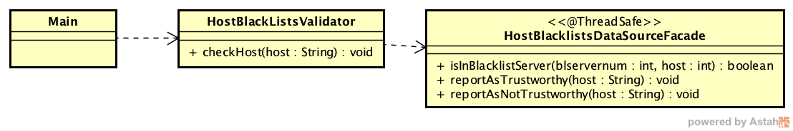

### Escuela Colombiana de Ingeniería
### Arquitecturas de Software - ARSW
## Ejercicio Introducción al paralelismo - Hilos - Caso BlackListSearch

### Dependencias:
####   Lecturas:
*  [Threads in Java](http://beginnersbook.com/2013/03/java-threads/)  (Hasta 'Ending Threads')
*  [Threads vs Processes]( http://cs-fundamentals.com/tech-interview/java/differences-between-thread-and-process-in-java.php)

### Descripción
  Este ejercicio contiene una introducción a la programación con hilos en Java, además de la aplicación a un caso concreto.
  

**Parte I - Introducción a Hilos en Java**

1. De acuerdo con lo revisado en las lecturas, complete las clases CountThread, para que las mismas definan el ciclo de vida de un hilo que imprima por pantalla los números entre A y B.

2. Complete el método __main__ de la clase CountMainThreads para que:
	1. Cree 3 hilos de tipo CountThread, asignándole al primero el intervalo [0..99], al segundo [99..199], y al tercero [200..299].
   	
	2. Inicie los tres hilos con 'start()'.
	   
 	3. Ejecute y revise la salida por pantalla.
   
        
 	4. Cambie el incio con 'start()' por 'run()'. Cómo cambia la salida?, por qué?.
     	Ahora la salida no parece que se ejecutan todos los hilos al mismo tiempo, sino que se hace de forma secuencial, según se llaman los métodos run(). Esto sucede porque cuando se usa el método start() se crea un nuevo hilo y luego se ejecuta el método run(), pero 	si se llama directamente el método run() entonces no se crea un nuevo hilo y el método se ejecutará como una llamada normal a un método en el hilo actual y no existiran multiples hilos ejecutandose.
	

**Parte II - Ejercicio Black List Search**

Para un software de vigilancia automática de seguridad informática se está desarrollando un componente encargado de validar las direcciones IP en varios miles de listas negras (de host maliciosos) conocidas, y reportar aquellas que existan en al menos cinco de dichas listas. 

Dicho componente está diseñado de acuerdo con el siguiente diagrama, donde:

- HostBlackListsDataSourceFacade es una clase que ofrece una 'fachada' para realizar consultas en cualquiera de las N listas negras registradas (método 'isInBlacklistServer'), y que permite también hacer un reporte a una base de datos local de cuando una dirección IP se considera peligrosa. Esta clase NO ES MODIFICABLE, pero se sabe que es 'Thread-Safe'.

- HostBlackListsValidator es una clase que ofrece el método 'checkHost', el cual, a través de la clase 'HostBlackListDataSourceFacade', valida en cada una de las listas negras un host determinado. En dicho método está considerada la política de que al encontrarse un HOST en al menos cinco listas negras, el mismo será registrado como 'no confiable', o como 'confiable' en caso contrario. Adicionalmente, retornará la lista de los números de las 'listas negras' en donde se encontró registrado el HOST.

Al usarse el módulo, la evidencia de que se hizo el registro como 'confiable' o 'no confiable' se dá por lo mensajes de LOGs:

INFO: HOST 205.24.34.55 Reported as trustworthy

INFO: HOST 205.24.34.55 Reported as NOT trustworthy

Al programa de prueba provisto (Main), le toma sólo algunos segundos análizar y reportar la dirección provista (200.24.34.55), ya que la misma está registrada más de cinco veces en los primeros servidores, por lo que no requiere recorrerlos todos. Sin embargo, hacer la búsqueda en casos donde NO hay reportes, o donde los mismos están dispersos en las miles de listas negras, toma bastante tiempo.

Éste, como cualquier método de búsqueda, puede verse como un problema [vergonzosamente paralelo](https://en.wikipedia.org/wiki/Embarrassingly_parallel), ya que no existen dependencias entre una partición del problema y otra.

Para 'refactorizar' este código, y hacer que explote la capacidad multi-núcleo de la CPU del equipo, realice lo siguiente:

1. Cree una clase de tipo Thread que represente el ciclo de vida de un hilo que haga la búsqueda de un segmento del conjunto de servidores disponibles. Agregue a dicha clase un método que permita 'preguntarle' a las instancias del mismo (los hilos) cuantas ocurrencias de servidores maliciosos ha encontrado o encontró.
   
   

2. Agregue al método 'checkHost' un parámetro entero N, correspondiente al número de hilos entre los que se va a realizar la búsqueda (recuerde tener en cuenta si N es par o impar!). Modifique el código de este método para que divida el espacio de búsqueda entre las N partes indicadas, y paralelice la búsqueda a través de N hilos. Haga que dicha función espere hasta que los N hilos terminen de resolver su respectivo sub-problema, agregue las ocurrencias encontradas por cada hilo a la lista que retorna el método, y entonces calcule (sumando el total de ocurrencuas encontradas por cada hilo) si el número de ocurrencias es mayor o igual a _BLACK_LIST_ALARM_COUNT_. Si se da este caso, al final se DEBE reportar el host como confiable o no confiable, y mostrar el listado con los números de las listas negras respectivas. Para lograr este comportamiento de 'espera' revise el método [join](https://docs.oracle.com/javase/tutorial/essential/concurrency/join.html) del API de concurrencia de Java. Tenga también en cuenta:

   	

	* Dentro del método checkHost Se debe mantener el LOG que informa, antes de retornar el resultado, el número de listas negras revisadas VS. el número de listas negras total (línea 60). Se debe garantizar que dicha información sea verídica bajo el nuevo esquema de procesamiento en paralelo planteado.

	* Se sabe que el HOST 202.24.34.55 está reportado en listas negras de una forma más dispersa, y que el host 212.24.24.55 NO está en ninguna lista negra.

    

    

**Parte II.I Para discutir la próxima clase (NO para implementar aún)**

La estrategia de paralelismo antes implementada es ineficiente en ciertos casos, pues la búsqueda se sigue realizando aún cuando los N hilos (en su conjunto) ya hayan encontrado el número mínimo de ocurrencias requeridas para reportar al servidor como malicioso. Cómo se podría modificar la implementación para minimizar el número de consultas en estos casos?, qué elemento nuevo traería esto al problema?

La idea sería permitir que todos los hilos detengan su búsqueda tan pronto como el número total de ocurrencias encontradas alcance el umbral BLACK_LIST_ALARM_COUNT. Para implementar esto, se podría utilizar una variable compartida entre los hilos, como un contador de ocurrencias global, que cada hilo pueda verificar y actualizar de manera concurrente. Una vez que este contador alcance el umbral deseado, los hilos que aún estén ejecutando deberían poder detenerse inmediatamente.

**Parte III - Evaluación de Desempeño**

A partir de lo anterior, implemente la siguiente secuencia de experimentos para realizar las validación de direcciones IP dispersas (por ejemplo 202.24.34.55), tomando los tiempos de ejecución de los mismos (asegúrese de hacerlos en la misma máquina):

1. Un solo hilo.
	
 	

 	- Tiempo de ejecución:

	

	- Consumo de CPU:

	

  	- Consumo de memoria:
     
     	
     
3. Tantos hilos como núcleos de procesamiento (haga que el programa determine esto haciendo uso del [API Runtime](https://docs.oracle.com/javase/7/docs/api/java/lang/Runtime.html)).
	
 	

 	- Tiempo de ejecución:

	

	- Consumo de CPU:

	

  	- Consumo de memoria:
     
     	
     
4. Tantos hilos como el doble de núcleos de procesamiento.
	
 	

 	- Tiempo de ejecución:

	

	- Consumo de CPU:

	

  	- Consumo de memoria:
     
     	
     
6. 50 hilos.
	
 	

 	- Tiempo de ejecución:

	

	- Consumo de CPU:

	

  	- Consumo de memoria:
     
     	
	
8. 100 hilos.
   
	

 	- Tiempo de ejecución:

	

	- Consumo de CPU:
	Hicimos la prueba varias veces pero no monitoriaba el uso de CPU, tenemos como hipotesis que sea por el tiempo de ejecución del programa

	

  	- Consumo de memoria:
     
     	

Al iniciar el programa ejecute el monitor jVisualVM, y a medida que corran las pruebas, revise y anote el consumo de CPU y de memoria en cada caso. 

Con lo anterior, y con los tiempos de ejecución dados, haga una gráfica de tiempo de solución vs. número de hilos. Analice y plantee hipótesis con su compañero para las siguientes preguntas (puede tener en cuenta lo reportado por jVisualVM):

La gráfica nos da la idea de que el uso de múltiples hilos mejora significativamente el tiempo de solución en la validación de IPs, especialmente cuando se pasa de un solo hilo a varios. Sin embargo, a partir de cierto punto, alrededor de los 50 hilos, la reducción del tiempo del proceso al aumentar los hilos se reduce considerablemente, lo que suponemos que podría deberse a la sobrecarga del sistema al manejar demasiados hilos simultáneamente o a la saturación de los recursos de hardware disponibles. 

**Parte IV - Ejercicio Black List Search**

1. Según la [ley de Amdahls](https://www.pugetsystems.com/labs/articles/Estimating-CPU-Performance-using-Amdahls-Law-619/#WhatisAmdahlsLaw?):

	, donde _S(n)_ es el mejoramiento teórico del desempeño, _P_ la fracción paralelizable del algoritmo, y _n_ el número de hilos, a mayor _n_, mayor debería ser dicha mejora. Por qué el mejor desempeño no se logra con los 500 hilos?, cómo se compara este desempeño cuando se usan 200?.

El mejor desempeño no se logra con 500 hilos porque, aunque en teoría más hilos deberían mejorar el rendimiento, en la práctica manejar tantos hilos al mismo tiempo genera más problemas de lo que soluciona. El sistema tiene que dedicar tiempo y recursos para coordinar todos esos hilos, lo que puede terminar haciéndolo más lento. Cuando se usan 200 hilos, el sistema parece estar en un punto donde todavía puede manejar bien la carga sin sobrecargarse.

2. Cómo se comporta la solución usando tantos hilos de procesamiento como núcleos comparado con el resultado de usar el doble de éste?.

Al comparar el uso de tantos hilos como núcleos de procesamiento (12 hilos) con el uso del doble de núcleos (24 hilos), se observa que el tiempo de ejecución se reduce considerablemente. Con 12 hilos, el tiempo es de 10.063 ms, mientras que al usar 24 hilos, el tiempo se reduce a 5.037 ms, prácticamente la mitad.
También se puede evidenciar y hay que tener en cuenta que el consumo de la cpu es mayor en el segundo caso.

3. De acuerdo con lo anterior, si para este problema en lugar de 100 hilos en una sola CPU se pudiera usar 1 hilo en cada una de 100 máquinas hipotéticas, la ley de Amdahls se aplicaría mejor?. Si en lugar de esto se usaran c hilos en 100/c máquinas distribuidas (siendo c es el número de núcleos de dichas máquinas), se mejoraría?. Explique su respuesta.

